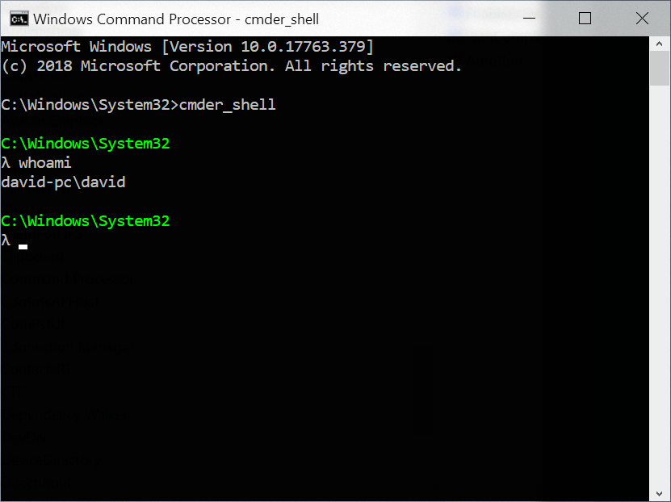

Follow me on Twitter 🐦, connect with me on LinkedIn 🔗, and check out my GitHub 🐙. You won't be disappointed!

👉 Twitter: https://twitter.com/NdiranguMuturi1
👉 LinkedIn: https://www.linkedin.com/in/isaac-muturi-3b6b2b237
👉 GitHub: https://github.com/Isaac-Ndirangu-Muturi-749

# Simple Shell

**Simple Shell** is a minimalistic Unix-like shell implementation written in C. This shell provides basic command-line features and can be run in both interactive and batch mode. It serves as a lightweight and educational introduction to how shells work.


## Table of Contents

- [Features](#features)
- [Getting Started](#getting-started)
  - [Prerequisites](#prerequisites)
  - [Building the Shell](#building-the-shell)
- [Usage](#usage)
  - [Interactive Mode](#interactive-mode)
  - [Batch Mode](#batch-mode)
- [Built-in Commands](#built-in-commands)
- [Contributing](#contributing)
- [License](#license)

## Features

- Basic command execution with support for external commands.
- Built-in commands such as `cd`, `env`, `exit`, and `alias`.
- Command history with up and down arrow keys.
- Alias support to define and use custom command aliases.
- Batch mode for executing commands from a script file.
- Simple and easy-to-understand codebase, suitable for educational purposes.

## Getting Started

### Prerequisites

Before you begin, ensure you have met the following requirements:

- A Unix-like operating system (e.g., Linux, macOS).
- GCC (GNU Compiler Collection) installed on your system.
- Basic knowledge of working with a command-line shell.

### Building the Shell

1. Clone this repository to your local machine:

   ```bash
   git clone https://github.com/yourusername/simple-shell.git
   ```

2. Navigate to the project directory:

   ```bash
   cd simple-shell
   ```

3. Build the shell using the provided Makefile:

   ```bash
   make
   ```

4. You should now have an executable named `simple-shell` in the project directory.

## Usage

### Interactive Mode

To run the shell in interactive mode, simply execute the `simple-shell` binary without any arguments:

```bash
./simple-shell
```

You will be presented with a shell prompt where you can enter commands interactively.

### Batch Mode

In batch mode, you can execute a series of commands from a script file. Provide the script file as an argument when running the shell:

```bash
./simple-shell batch_script.txt
```

The shell will read and execute the commands from the specified script file.

## Built-in Commands

The Simple Shell supports the following built-in commands:

- `cd`: Change the current working directory.
- `env`: Display the environment variables.
- `exit`: Exit the shell.
- `alias`: Define and manage custom command aliases.

For more details on using these commands, refer to the [Built-in Commands](docs/built-in-commands.md) documentation.

## Contributing

Contributions are welcome! To contribute to this project, follow these steps:

1. Fork the project repository.
2. Create a new branch for your feature or bug fix.
3. Make your changes and ensure that the code passes all tests.
4. Create a pull request (PR) to the main repository.

For more information on contributing, please read our [Contribution Guidelines](CONTRIBUTING.md).

## License

This project is licensed under the MIT License - see the [LICENSE](LICENSE) file for details.

Follow me on Twitter 🐦, connect with me on LinkedIn 🔗, and check out my GitHub 🐙. You won't be disappointed!

👉 Twitter: https://twitter.com/NdiranguMuturi1
👉 LinkedIn: https://www.linkedin.com/in/isaac-muturi-3b6b2b237
👉 GitHub: https://github.com/Isaac-Ndirangu-Muturi-749